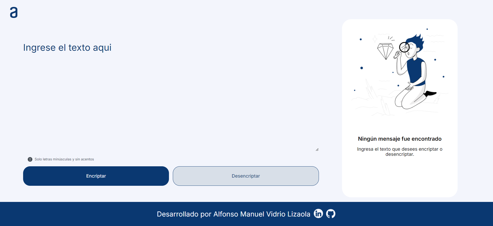

# Encriptador de Texto

Este proyecto es un encriptador de texto simple desarrollado con HTML, CSS y JavaScript. Permite al usuario encriptar y desencriptar texto utilizando un conjunto específico de reglas de transformación de letras.

## Funcionalidades

- **Encriptación**: Convierte letras según las siguientes reglas:
  - La letra "e" se convierte en "enter"
  - La letra "i" se convierte en "imes"
  - La letra "a" se convierte en "ai"
  - La letra "o" se convierte en "ober"
  - La letra "u" se convierte en "ufat"

- **Desencriptación**: Revierte el texto encriptado de vuelta a su forma original.

- **Validación**: Verifica que el texto ingresado contenga solo letras minúsculas y caracteres permitidos antes de procesar.

- **Copiar al Portapapeles**: Permite al usuario copiar el texto encriptado o desencriptado al portapapeles con un solo clic.

## Estructura del Proyecto

El proyecto está estructurado de la siguiente manera:

- **index.html**: Contiene la estructura básica del sitio web y los elementos de la interfaz de usuario.
  
- **styles/**:
  - **normalize.css**: Hoja de estilos para normalizar los estilos predeterminados del navegador.
  - **style.css**: Hoja de estilos personalizada para estilizar la interfaz de usuario del encriptador de texto.

- **assets/**: Carpeta que contiene imágenes y otros recursos utilizados en el proyecto.

- **app.js**: Archivo JavaScript que contiene la lógica de encriptación, desencriptación, manipulación de DOM y funcionalidad de copiado al portapapeles.

## Uso

1. **Ingreso de Texto**: Escribe el texto que deseas encriptar o desencriptar en el área de texto provista.
   
2. **Selección de Acción**:
   - Haz clic en el botón "Encriptar" para convertir el texto ingresado según las reglas de encriptación.
   - Haz clic en el botón "Desencriptar" para revertir el texto encriptado a su forma original.

3. **Visualización del Resultado**: El resultado de la operación (encriptación o desencriptación) se mostrará en el área de salida.

4. **Copiado al Portapapeles**:
   - Haz clic en el botón "Copiar texto" para copiar el texto encriptado o desencriptado al portapapeles.
   - Se mostrará una confirmación visual cuando el texto se haya copiado correctamente.

## Autor

Desarrollado por Alfonso Manuel Vidrio Lizaola.

- LinkedIn: [Alfonso Manuel Vidrio Lizaola](https://www.linkedin.com/in/alfonsomanuelvidriolizaola/)

## Tecnologías Utilizadas

- HTML
- CSS
- JavaScript

## Insignia

